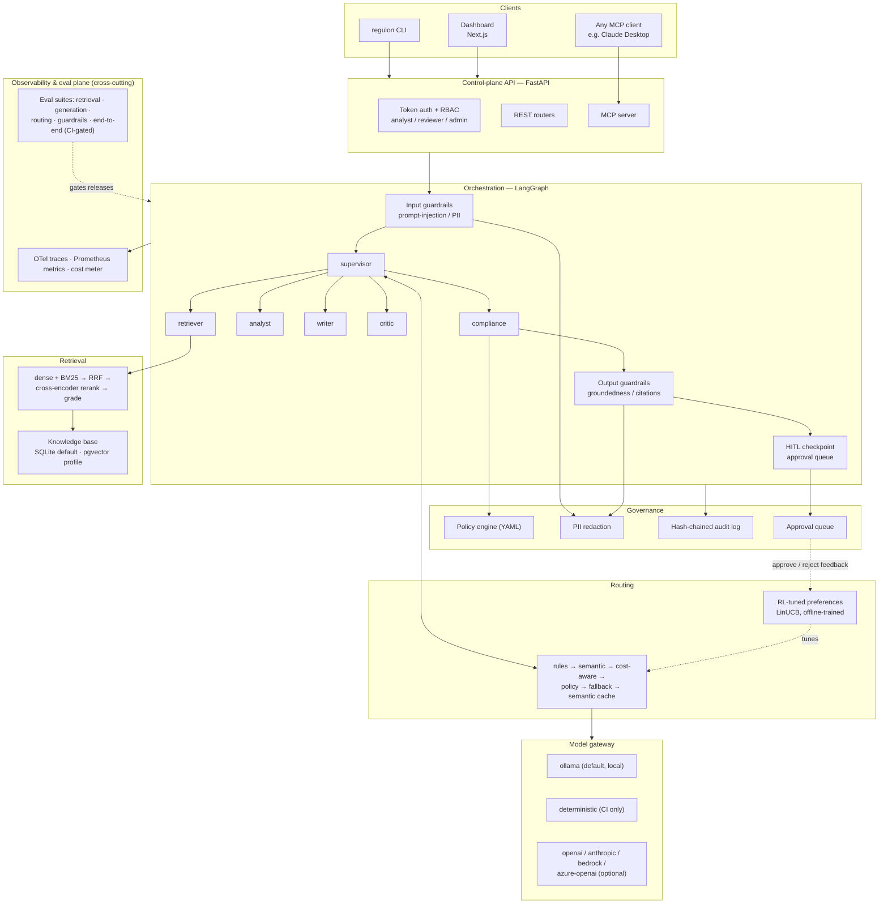
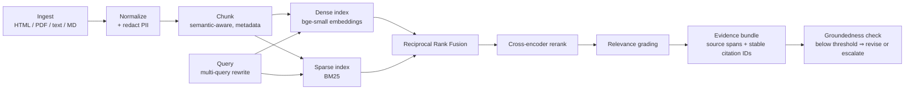

<div align="center">

# Regulon

**Governed multi-agent RAG, built in the open — every answer cited, every decision traced,
every risky action approved by a human, every release gated by evals.**

[](https://github.com/shakehasan/regulon/actions/workflows/ci.yml)
[](https://github.com/shakehasan/regulon/actions/workflows/safety.yml)
[](LICENSE)
[](pyproject.toml)
[](https://github.com/langchain-ai/langgraph)
[](docs/adr/002-local-first-real-inference.md)
[](Makefile)

**Author:** Shake MD Tareq Hasan · GitHub [@shakehasan](https://github.com/shakehasan)

</div>

---

Regulon is an open-source platform for running multi-agent LLM systems the way regulated
industries need them run. Most agent frameworks stop at orchestration; Regulon treats the
**governance control plane as the product**: grounded and cited answers, explainable routing,
role-based access, tamper-evident audit trails, human-in-the-loop approval, and evaluation gates
wired into CI. It is a solo-built community project — the goal is that any engineer can clone it,
run a real multi-agent system locally for $0, study how it is engineered, and reuse the parts.

**What is different here:**

- **A governed control plane, not a bolt-on** — RBAC · YAML policies · hash-chained audit log · human approval queue, all first-class graph citizens.
- **Routing that learns** — six layered routing strategies, with an offline RL optimizer (LinUCB) tuned by human approve/reject decisions and eval scores.
- **Evidence over adjectives** — hermetic eval gates fail the build; committed reports come only from real runs. If a number can't be produced by running the code, it isn't written down.

> **Status: built in the open, milestone by milestone.** The full specification is public in
> [PLAN.md](PLAN.md); progress is tracked in the [milestones](#milestones) table below. Everything
> marked ✅ is real and CI-verified today; everything else is the committed design.

## Table of contents

- [Why this exists](#why-this-exists)
- [Highlights](#highlights)
- [Architecture](#architecture)
  - [The agent workforce](#the-agent-workforce)
  - [Layers and responsibilities](#layers-and-responsibilities)
  - [RAG pipeline](#rag-pipeline)
- [Routing modes](#routing-modes)
- [Governance & HITL](#governance--hitl)
- [Evaluation](#evaluation)
- [Quickstart](#quickstart)
- [Configuration](#configuration)
- [Project layout](#project-layout)
- [Milestones](#milestones)
- [Contributing · Security · Code of Conduct](#contributing--security--code-of-conduct)
- [FAQ](#faq)
- [Disclaimer](#disclaimer)
- [License](#license)

## Why this exists

Wiring agents together is easy now. Governing many of them reliably is not — it is a systems
problem. Teams in finance, healthcare, and legal need answers grounded in cited evidence,
routing decisions that can be explained after the fact, human sign-off before anything becomes
final, access control on every mutating action, and releases gated by evaluation rather than
vibes. Public, runnable examples that treat those as integrated first-class concerns are scarce.

Regulon is one engineer's attempt to close that gap in the open: a complete, reproducible,
local-first platform the GitHub community can run, audit, learn from, and build on. The flagship
reference app, **Research Desk**, is a multi-agent investment-research workflow over public SEC
EDGAR filings that produces citation-backed briefs — and no brief is final until a human approves it.

## Highlights

Each capability lands in the milestone shown; ✅ means merged and CI-verified.

1. Typed core with audit-chain hashing, injectable clock, and config hashing for traceable reports — **M0 ✅**
2. Public-safety scanner with a configurable denylist, enforced in CI and pre-commit — **M0 ✅**
3. SEC EDGAR ingestion + clearly-labeled synthetic corpora; PII redaction at ingest — M1
4. Hybrid retrieval: dense (bge-small) + BM25 → Reciprocal Rank Fusion → cross-encoder reranking → relevance grading — M2
5. Evidence bundles with exact source spans and stable citation IDs; groundedness verification — M2
6. Model gateway: Ollama by default ($0, local), `deterministic` provider for hermetic CI, optional cloud adapters — M3
7. Token and cost accounting on every model call, surfaced per run — M3
8. LangGraph supervisor + 5 specialist agents with typed Pydantic state and enforced budgets — M4
9. Bounded critic revision loop and fail-closed guardrail nodes — M4
10. Six routing strategies emitting auditable `RouteDecision` records — M5
11. RBAC (`analyst` / `reviewer` / `admin`), YAML policy engine, hash-chained audit log with a verify command — M6
12. HITL approval queue driven by REST, CLI, and MCP — any MCP client can operate Regulon — M6
13. Evaluation program: retrieval, generation, routing, guardrail (30+ attack suite), and end-to-end gates that fail CI — M7
14. OpenTelemetry traces, Prometheus metrics, Grafana dashboard, per-run cost meter; Docker + reference k8s — M8
15. Offline RL (LinUCB + epsilon-greedy) tuning routing preferences from human + eval feedback, behind a flag — M9

## Architecture

Every request flows through the same spine: authenticated API → governed orchestration → routed
model calls → grounded retrieval — with an observability and eval-gate plane cutting across every
layer, and human approval before anything becomes final.


<details>
<summary><b>Text version (Mermaid source)</b></summary>



</details>

### The agent workforce

One supervisor and five specialists, orchestrated as a LangGraph supervisor graph with typed
Pydantic state, explicit conditional edges, and enforced step budgets.

| Agent | Role | Inputs | Outputs | Guardrails applied |
|---|---|---|---|---|
| `supervisor` | Plans, decomposes, routes sub-tasks, aggregates | Research task, agent results | Sub-task assignments, final aggregation | Loop/step budgets, recursion limit |
| `retriever` | Query rewriting + hybrid retrieval + reranking | Sub-task queries | Evidence bundles with source spans + citation IDs | Relevance grading |
| `analyst` | Numeric/tabular reasoning over evidence | Evidence bundles | Computed figures (revenue deltas, comparisons) | Safe calculator + table extractor only (no free-form code) |
| `writer` | Drafts the brief strictly from evidence | Evidence bundles, analyst figures | Draft brief with inline `[S1]` citations | Citation-required policy |
| `critic` | Checks claim–evidence alignment | Draft brief + evidence | Flags on uncited claims; one bounded revision loop | Revision loop capped at 1 |
| `compliance` | Policy + redaction pass on the final draft | Revised brief | Cleared brief, or forced HITL escalation | Policy engine, PII redaction, fail-closed escalation |

The finished brief never publishes itself: it lands in the approval queue as `pending_review`, and
only a `reviewer` role can mark it `final`.

### Layers and responsibilities

| Layer | Modules | Responsibility | Milestone |
|---|---|---|---|
| Core | `src/regulon/core/` | Config (YAML + env), ids, events, errors, hashing (audit-chain primitive), clock | M0 ✅ |
| Ingestion | `src/regulon/ingestion/` | EDGAR fetch, loaders, normalization, semantic chunking with metadata, redaction-on-ingest | M1 |
| Retrieval | `src/regulon/retrieval/` | Dual index (dense + BM25), RRF fusion, cross-encoder reranking, relevance grading, cited evidence bundles | M2 |
| Model gateway | `src/regulon/gateway/` | Provider adapters, model registry with cost/latency metadata, token & cost accounting | M3 |
| Agents | `src/regulon/agents/` | Supervisor + 5 specialists (retriever, analyst, writer, critic, compliance), typed state, prompts | M4 |
| Orchestration | `src/regulon/orchestration/` | Graph build, budgets, bounded critic loop, HITL checkpoint nodes, structured run events | M4 |
| Routing | `src/regulon/routing/` | Rule / semantic / cost-aware / policy routing, fallback chains, semantic cache, RL optimizer | M5, M9 |
| Governance | `src/regulon/governance/` | RBAC, policy engine, output redaction, hash-chained audit log, approval queue, webhook notifier | M6 |
| API & MCP | `src/regulon/api/`, `src/regulon/mcp/` | FastAPI routers + auth dependencies; MCP tools (`ingest`, `research`, `retrieve`, `review_list`, `approve`) | M6 |
| Evaluation | `src/regulon/evals/` | Golden datasets, RAGAS + local LLM-judge, routing & guardrail suites, hard CI gates | M2, M7 |
| Observability | `src/regulon/observability/` | OTel spans, JSONL trace export + HTML viewer, Prometheus metrics, cost meter | M8 |
| CLI | `src/regulon/cli/` | `regulon ingest · retrieve · ask · research · review · audit verify · trace view` | M1–M8 |
| Dashboard | `apps/dashboard/` | Runs, run detail, approvals, evals, traces (talks only to the API) | M10 |

### RAG pipeline



Answers are never returned silently when groundedness falls below threshold — they are revised
once (bounded critic loop) or escalated to human review.

## Routing modes

Six independently-testable strategies, layered so the safest rule always wins. Every decision
emits a `RouteDecision` record (candidates, scores, chosen arm, reason, cost estimate) into the
trace — a real captured example will be published here when the router lands in M5.

| # | Strategy | What it does | Config |
|---|---|---|---|
| 1 | Rule routing | Deterministic intent → agent/model table | YAML |
| 2 | Semantic routing | Embedding similarity to route exemplars when rules miss | exemplar sets |
| 3 | Cost/latency-aware | Cheapest model satisfying the task's capability + context needs; per-request and per-run budget caps | model registry |
| 4 | Policy routing | Sensitive topics forced to stricter pipelines (higher groundedness bar + mandatory HITL) | policy YAML |
| 5 | Fallback chains | Timeout / error / low-confidence cascades to the next candidate; every hop recorded | chain config |
| 6 | Semantic cache | Embedding-similarity cache with hit/miss metrics and measured savings | threshold |

On top of these, an **offline RL optimizer** (M9) — LinUCB with an epsilon-greedy baseline —
learns routing preferences from a reward built out of eval scores, human approve/reject decisions,
cost, and latency. It only re-orders *safe* candidates: policy routing and guardrails always
override it.

## Governance & HITL

**RBAC capability matrix** (enforced by FastAPI dependencies on every mutating endpoint; local
token auth, no paid identity provider):

| Capability | analyst | reviewer | admin |
|---|:-:|:-:|:-:|
| Ingest documents, run research | ✅ | ✅ | ✅ |
| View own runs and traces | ✅ | ✅ | ✅ |
| View all runs, approve / reject briefs | — | ✅ | ✅ |
| Manage tokens, roles, and policies | — | — | ✅ |

**Policy engine** — YAML policies evaluated pre- and post-generation. Illustrative shape (the
final schema ships with M6):

```yaml
- id: sensitive-topic-escalation
  when:
    topic_any: [earnings-guidance, litigation]
  then:
    min_groundedness: high   # stricter threshold from config
    require_hitl: true
    disclosure_footer: research-education
```

**Audit log** — append-only JSONL where each record commits to the SHA-256 of the previous record
(the chain primitive, `chain_hash`, is already implemented and tested in
[`core/hashing.py`](src/regulon/core/hashing.py)). Any edit to history breaks the chain, and
`regulon audit verify` (M6) walks it end to end. Tamper-*evident*, not tamper-proof — the threat
model document (M6) spells out the boundary.

**Approval flow** — a finished brief enters the queue as `pending_review`; a `reviewer` approves
or rejects with a reason; only approved briefs become `final`; every decision is recorded both in
the audit chain and as a feedback signal for RL routing.

## Evaluation

Two tiers, per [ADR-002](docs/adr/002-local-first-real-inference.md):

| Tier | Command | Model | Where | Purpose |
|---|---|---|---|---|
| Hermetic | `make eval` | `deterministic` (seeded, no network) | CI, every push | **Hard gates — regressions fail the build** |
| Real | `make eval-real` | local model via Ollama | maintainer machine | Committed reports in `reports/` with timestamp, config hash, machine spec |

Suites: retrieval (recall@k, MRR, nDCG) · generation (faithfulness, citation precision/recall,
answer relevance — RAGAS + a local LLM-judge) · routing accuracy & cost-efficiency · a 30+
prompt-injection/leak adversarial suite with block-rate reporting · end-to-end golden briefs.
Thresholds are pinned in `config/` and recorded in ADR-009 as each suite lands (M2 retrieval,
M7 full program). **No number appears in this repo unless a command produced it.**

## Quickstart

Today (M0 — scaffold and quality gates):

```bash
git clone https://github.com/shakehasan/regulon.git
cd regulon
make setup            # venv + editable install + pre-commit hooks
make lint type test   # ruff · mypy strict · pytest with 80% coverage gate
make safety           # public-safety denylist scan
```

Requirements: Python 3.11+, GNU make, git. Works on Linux, macOS, and Windows (Git Bash).

From M3/M4 onward the demo path becomes:

```bash
make setup
ollama pull qwen2.5:7b-instruct   # or the documented low-RAM alternative
make demo                          # real multi-agent run: cited brief → approval queue
```

The demo always runs a real local model — never canned output.

## Configuration

All tunables live in [`config/regulon.yaml`](config/regulon.yaml); environment variables with the
`REGULON_` prefix override the file. No magic numbers in code.

| Variable | Default | Purpose |
|---|---|---|
| `REGULON_ENVIRONMENT` | `dev` | Runtime environment name (`dev` / `ci` / `prod`) |
| `REGULON_DATA_DIR` | `./data` | Root for local data (knowledge base, queues, audit log) |
| `REGULON_CONFIG_FILE` | `config/regulon.yaml` | Alternate config file path |

Sections grow milestone by milestone (model registry, thresholds, budgets, policies); each ships
with its milestone and is documented here. See [`.env.example`](.env.example).

## Project layout

```
regulon/
├── PLAN.md                # the full public build specification
├── AGENTS.md              # engineering conventions for contributors & coding agents
├── config/                # all tunables: runtime config + safety denylist
├── docs/
│   ├── adr/               # architecture decision records (ADR-001, ADR-002, ...)
│   └── assets/            # original diagrams for this repo
├── scripts/               # public_safety_scan.py + data tooling (M1)
├── src/regulon/
│   ├── core/              # ✅ config · ids · events · errors · hashing · clock
│   ├── ingestion/         # M1  loaders · edgar client · chunkers · redaction
│   ├── retrieval/         # M2  stores (sqlite|pgvector) · bm25 · fusion · reranker
│   ├── gateway/           # M3  provider adapters · model registry · cost accounting
│   ├── agents/            # M4  supervisor + specialists · typed state · prompts
│   ├── orchestration/     # M4  graph build · budgets · hitl nodes
│   ├── routing/           # M5  rules · semantic · cost · policy · fallback · cache · rl/
│   ├── governance/        # M6  rbac · policies · audit chain · approval queue
│   ├── api/ · mcp/ · cli/ # M6  FastAPI · MCP server · Typer CLI (grows M1→M8)
│   ├── evals/             # M7  suites · judges · datasets · gates
│   └── observability/     # M8  otel · metrics · trace viewer
├── apps/dashboard/        # M10 Next.js dashboard
├── data/samples/          # public-domain filing excerpts + SYNTHETIC_ docs (M1)
├── ops/                   # M8  grafana · k8s · locust
├── reports/               # M7+ committed real-run artifacts (never hand-written)
└── tests/                 # unit · integration · adversarial
```

## Milestones

| Milestone | Scope | Status |
|---|---|---|
| M0 | Scaffold & repo governance | ✅ Done |
| M1 | Ingestion & knowledge base | Planned |
| M2 | Hybrid retrieval | Planned |
| M3 | Model gateway + real inference | Planned |
| M4 | Agents & orchestration | Planned |
| M5 | Routing subsystem | Planned |
| M6 | Governance control plane | Planned |
| M7 | Evaluation program | Planned |
| M8 | Observability & ops | Planned |
| M9 | RL routing optimizer | Planned |
| M10 | Dashboard + launch polish | Planned |

Detail and acceptance criteria: [ROADMAP.md](ROADMAP.md) · full spec: [PLAN.md](PLAN.md).

## Contributing · Security · Code of Conduct

Contributions are welcome — start with [CONTRIBUTING.md](CONTRIBUTING.md) and the conventions in
[AGENTS.md](AGENTS.md). Security reports go through
[GitHub Security Advisories](https://github.com/shakehasan/regulon/security/advisories/new), not
public issues — see [SECURITY.md](SECURITY.md). All participation is covered by the
[Code of Conduct](CODE_OF_CONDUCT.md).

## FAQ

**Why local-first?** So anyone can run the whole platform without paid services, API keys, or
accounts — reproducibility is the point. Cloud adapters exist but are optional. See
[ADR-002](docs/adr/002-local-first-real-inference.md).

**Why is there a `deterministic` provider in CI?** Hermetic tests and eval gates need to run
without a model server and produce identical results every time. It is never the default and never
used in demos or committed reports.

**Can I use cloud models?** Yes — set the relevant API key and the gateway's `openai`,
`anthropic`, `bedrock`, or `azure-openai` adapters activate. The router treats them as candidates
with their own cost/latency metadata.

**Why SEC filings as the demo domain?** They are public-domain, information-dense, and realistic
for a governed research workflow — and they keep the repo free of proprietary data. The only other
data source is synthetic documents clearly labeled `SYNTHETIC`.

**How do I add an agent / provider / policy?** Each subsystem ships with its milestone and a
how-to lands in `docs/` alongside it. The short version: agents are LangGraph nodes over the typed
state model; providers implement the gateway interface; policies are YAML evaluated by the policy
engine.

**Why is the build plan public?** The spec-first, milestone-gated process is part of what this
repo is meant to share — not just the code, but how it gets built and verified.

**What does "Regulon" mean?** In biology, a regulon is a set of genes governed as one unit. Here:
a set of agents governed by one control plane.

## Disclaimer

Regulon is a research and education tool. Nothing it produces is investment advice.

## License

[MIT](LICENSE) © 2026 Shake MD Tareq Hasan
