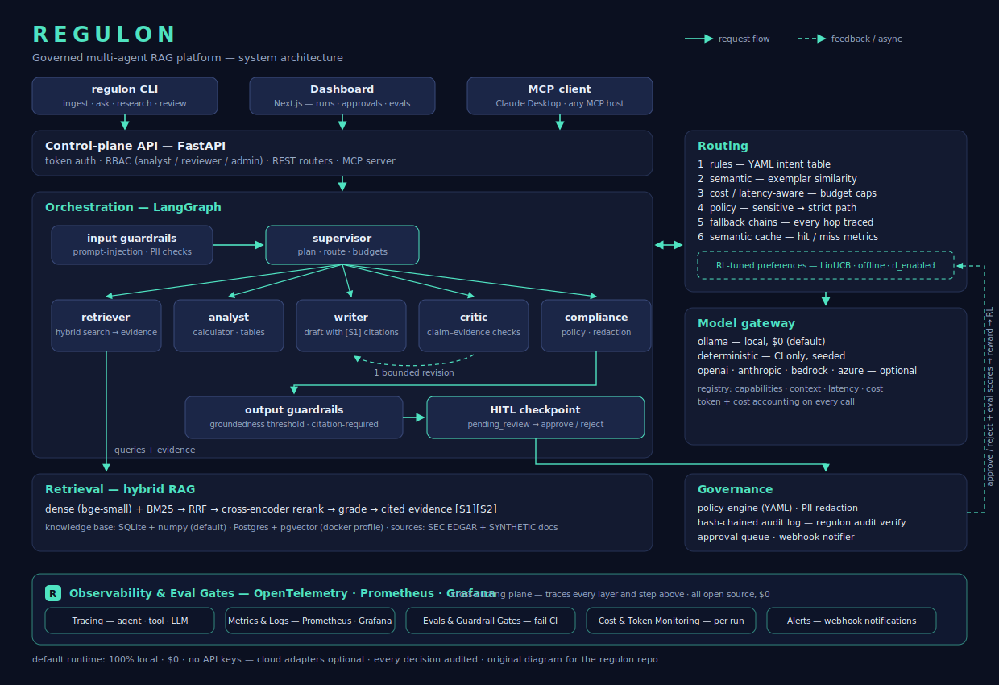
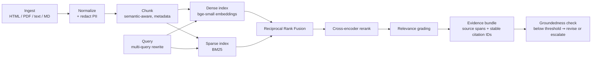

# Regulon

Regulon is an open-source reference platform for running multi-agent LLM systems the way regulated
industries need them run — every answer grounded and cited, every decision routed and traced, every
risky action approved by a human, every release gated by evals.

**Author:** Shake MD Tareq Hasan · GitHub [@shakehasan](https://github.com/shakehasan)

> **Status: under construction.** Regulon is being built milestone by milestone against a public
> specification ([PLAN.md](PLAN.md)). The table below tracks progress; the full README described in
> the plan lands with M10.

## What this will be

- A LangGraph supervisor orchestrating specialist agents (retriever, analyst, writer, critic, compliance)
  over a hybrid-retrieval RAG pipeline with cross-encoder reranking and mandatory citations.
- A governance control plane: RBAC, YAML policy engine, PII redaction, a hash-chained audit log, and a
  human-in-the-loop approval queue.
- Multi-mode routing (rules, semantic, cost-aware, policy, fallback, semantic cache) with an offline
  RL optimizer tuned by human and eval feedback.
- An evaluation program with hermetic CI gates and committed real-run reports.
- Local-first: the default runtime needs zero paid services, zero API keys, zero accounts. Demos run a
  real local model via Ollama.

The flagship reference app is **Research Desk** — a multi-agent investment research workflow over public
SEC EDGAR filings that produces citation-backed briefs, with human approval required before a brief is
finalized.

## Architecture

The target architecture, built milestone by milestone. Every request flows through the same spine:
authenticated API → governed orchestration → routed model calls → grounded retrieval — with every
decision audited and every finished brief held for human approval.



<details>
<summary><b>Text version (Mermaid source)</b></summary>


</details>

### The agent workforce

One supervisor and five specialists, orchestrated as a LangGraph supervisor graph with typed
Pydantic state, explicit conditional edges, and enforced step budgets.

| Agent | Role | Inputs | Outputs | Guardrails applied |
|---|---|---|---|---|
| `supervisor` | Plans, decomposes, routes sub-tasks, aggregates | Research task, agent results | Sub-task assignments, final aggregation | Loop/step budgets, recursion limit |
| `retriever` | Query rewriting + hybrid retrieval + reranking | Sub-task queries | Evidence bundles with source spans + citation IDs | Relevance grading |
| `analyst` | Numeric/tabular reasoning over evidence | Evidence bundles | Computed figures (revenue deltas, comparisons) | Safe calculator + table extractor only (no free-form code) |
| `writer` | Drafts the brief strictly from evidence | Evidence bundles, analyst figures | Draft brief with inline `[S1]` citations | Citation-required policy |
| `critic` | Checks claim–evidence alignment | Draft brief + evidence | Flags on uncited claims; one bounded revision loop | Revision loop capped at 1 |
| `compliance` | Policy + redaction pass on the final draft | Revised brief | Cleared brief, or forced HITL escalation | Policy engine, PII redaction, fail-closed escalation |

The finished brief never publishes itself: it lands in the approval queue as `pending_review`, and
only a `reviewer` role can mark it `final`.

### Layers and responsibilities

| Layer | Modules | Responsibility | Milestone |
|---|---|---|---|
| Core | `src/regulon/core/` | Config (YAML + env), ids, events, errors, hashing (audit-chain primitive), clock | M0 ✅ |
| Ingestion | `src/regulon/ingestion/` | EDGAR fetch, loaders, normalization, semantic chunking with metadata, redaction-on-ingest | M1 |
| Retrieval | `src/regulon/retrieval/` | Dual index (dense + BM25), RRF fusion, cross-encoder reranking, relevance grading, cited evidence bundles | M2 |
| Model gateway | `src/regulon/gateway/` | Provider adapters, model registry with cost/latency metadata, token & cost accounting | M3 |
| Agents | `src/regulon/agents/` | Supervisor + 5 specialists (retriever, analyst, writer, critic, compliance), typed state, prompts | M4 |
| Orchestration | `src/regulon/orchestration/` | Graph build, budgets, bounded critic loop, HITL checkpoint nodes, structured run events | M4 |
| Routing | `src/regulon/routing/` | Rule / semantic / cost-aware / policy routing, fallback chains, semantic cache, RL optimizer | M5, M9 |
| Governance | `src/regulon/governance/` | RBAC, policy engine, output redaction, hash-chained audit log, approval queue, webhook notifier | M6 |
| API & MCP | `src/regulon/api/`, `src/regulon/mcp/` | FastAPI routers + auth dependencies; MCP tools (`ingest`, `research`, `retrieve`, `review_list`, `approve`) | M6 |
| Evaluation | `src/regulon/evals/` | Golden datasets, RAGAS + local LLM-judge, routing & guardrail suites, hard CI gates | M2, M7 |
| Observability | `src/regulon/observability/` | OTel spans, JSONL trace export + HTML viewer, Prometheus metrics, cost meter | M8 |
| CLI | `src/regulon/cli/` | `regulon ingest · retrieve · ask · research · review · audit verify · trace view` | M1–M8 |
| Dashboard | `apps/dashboard/` | Runs, run detail, approvals, evals, traces (talks only to the API) | M10 |

### RAG pipeline



Answers are never returned silently when groundedness falls below threshold — they are revised
once (bounded critic loop) or escalated to human review.

## Milestones

| Milestone | Scope | Status |
|---|---|---|
| M0 | Scaffold & repo governance | ✅ Done |
| M1 | Ingestion & knowledge base | Planned |
| M2 | Hybrid retrieval | Planned |
| M3 | Model gateway + real inference | Planned |
| M4 | Agents & orchestration | Planned |
| M5 | Routing subsystem | Planned |
| M6 | Governance control plane | Planned |
| M7 | Evaluation program | Planned |
| M8 | Observability & ops | Planned |
| M9 | RL routing optimizer | Planned |
| M10 | Dashboard + launch polish | Planned |

See [ROADMAP.md](ROADMAP.md) for detail.

## Development

```bash
make setup   # venv + editable install + pre-commit hooks
make lint    # ruff check + format verification
make type    # mypy (strict on src/)
make test    # pytest with coverage gate (>= 80%)
make safety  # public-safety scan
```

Engineering conventions live in [AGENTS.md](AGENTS.md). Architecturally significant decisions are
recorded as ADRs under [docs/adr/](docs/adr/).

## Disclaimer

Regulon is a research and education tool. Nothing it produces is investment advice.

## License

[MIT](LICENSE) © 2026 Shake MD Tareq Hasan
