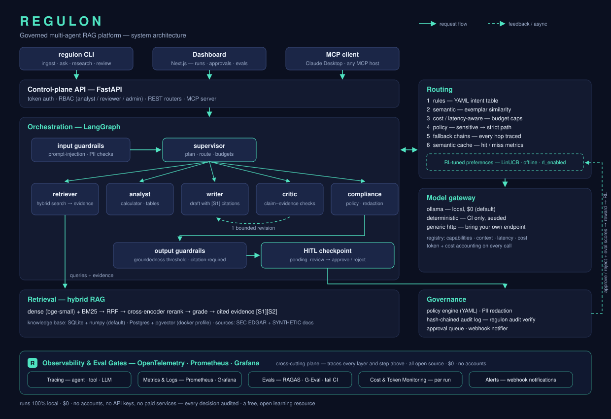
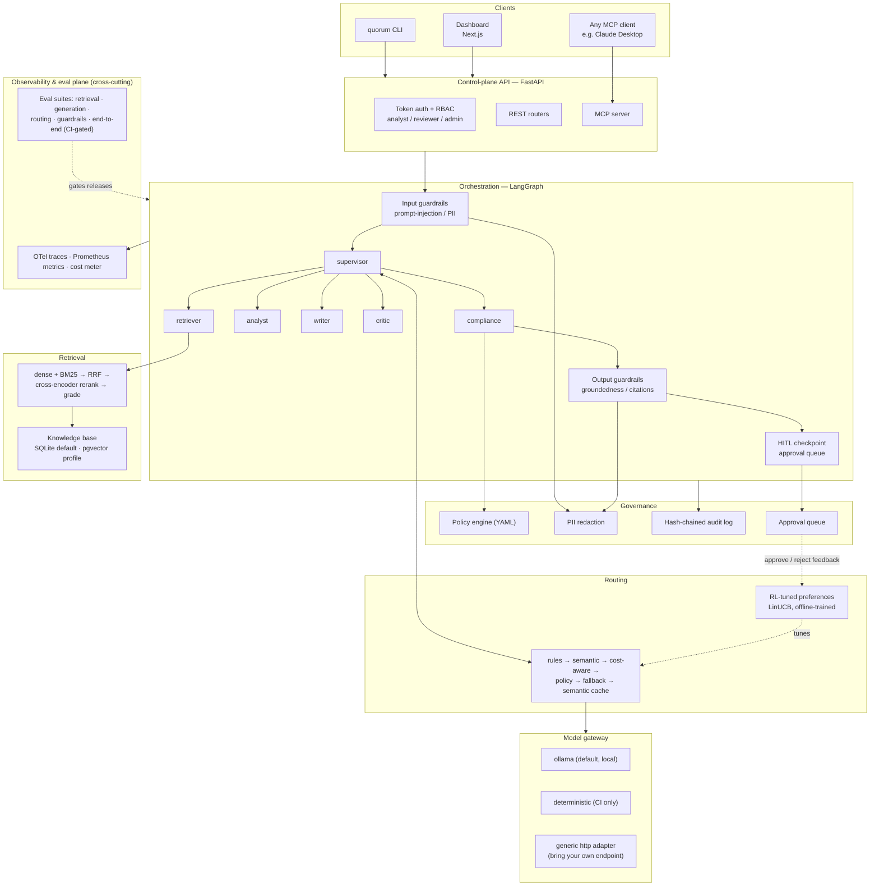
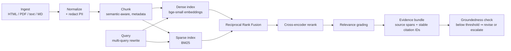

<div align="center">

# Quorum

**Governed multi-agent RAG, built in the open — every answer cited, every decision traced,
every risky action approved by a human, every release gated by evals.**

[](https://github.com/shakehasan/quorum/actions/workflows/ci.yml)
[](https://github.com/shakehasan/quorum/actions/workflows/safety.yml)
[](LICENSE)
[](pyproject.toml)
[](https://github.com/langchain-ai/langgraph)
[](docs/adr/002-local-first-real-inference.md)
[](Makefile)
[](https://github.com/pre-commit/pre-commit)

**Author:** Shake MD Tareq Hasan · GitHub [@shakehasan](https://github.com/shakehasan)

</div>

---

Quorum is an open-source platform for running multi-agent LLM systems the way regulated
industries need them run. Most agent frameworks stop at orchestration; Quorum treats the
**governance control plane as the product**: grounded and cited answers, explainable routing,
role-based access, tamper-evident audit trails, human-in-the-loop approval, and evaluation gates
wired into CI.

**This is a learning resource, built in the open and free forever.** It exists so that anyone —
students, self-taught engineers, teams evaluating agent architectures — can clone a complete
governed multi-agent system, run it end to end on their own laptop, read how every part works,
and take the pieces they need into their own projects. Use it to learn, teach, fork, or extend it.

**It costs nothing to run.** No accounts, no API keys, no sign-ups, no free tiers to exhaust, no
paid dependency anywhere. Every component is open source and runs locally: the models (via
Ollama), the vector and keyword indexes, the evaluation judges, the tracing, and the metrics.

**What is different here:**

- **A governed control plane, not a bolt-on** — RBAC · YAML policies · hash-chained audit log · human approval queue, all first-class graph citizens.
- **Routing that learns** — six layered routing strategies, with an offline RL optimizer (LinUCB) tuned by human approve/reject decisions and eval scores.
- **Evidence over adjectives** — hermetic eval gates fail the build; committed reports come only from real runs. If a number can't be produced by running the code, it isn't written down.

> **Status: built in the open, milestone by milestone.** The full specification is public in
> [PLAN.md](PLAN.md); progress is tracked in the [milestones](#milestones) table below. Everything
> marked ✅ is real and CI-verified today; everything else is the committed design.

## Table of contents

- [Why this exists](#why-this-exists)
- [Highlights](#highlights)
- [Architecture](#architecture)
  - [The agent workforce](#the-agent-workforce)
  - [Layers and responsibilities](#layers-and-responsibilities)
  - [RAG pipeline](#rag-pipeline)
- [Routing modes](#routing-modes)
- [Governance & HITL](#governance--hitl)
- [Evaluation](#evaluation)
- [Quickstart](#quickstart)
- [Configuration](#configuration)
- [Project layout](#project-layout)
- [Glossary](#glossary)
- [Milestones](#milestones)
- [Contributing · Security · Code of Conduct](#contributing--security--code-of-conduct)
- [FAQ](#faq)
- [Disclaimer](#disclaimer)
- [License](#license)

## Why this exists

Wiring agents together is easy now. Governing many of them reliably is not — it is a systems
problem. Teams in finance, healthcare, and legal need answers grounded in cited evidence,
routing decisions that can be explained after the fact, human sign-off before anything becomes
final, access control on every mutating action, and releases gated by evaluation rather than
vibes. Public, runnable examples that treat those as integrated first-class concerns are scarce.

Quorum is one engineer's attempt to close that gap in the open: a complete, reproducible,
local-first platform the GitHub community can run, audit, learn from, and build on. The flagship
reference app, **Research Desk**, is a multi-agent investment-research workflow over public SEC
EDGAR filings that produces citation-backed briefs — and no brief is final until a human approves it.

## Highlights

Each capability lands in the milestone shown; ✅ means merged and CI-verified.

1. Typed core with audit-chain hashing, injectable clock, and config hashing for traceable reports — **M0 ✅**
2. Public-safety scanner with a configurable denylist, enforced in CI and pre-commit — **M0 ✅**
3. Ingestion: HTML/PDF/Markdown/text loaders, section-aware chunking with exact source offsets and deterministic ids, PII redaction before storage, SQLite knowledge base, EDGAR fetch client, labeled synthetic corpus generator, all driven by `quorum ingest` — **M1 ✅**
4. Hybrid retrieval: dense (bge-small) + BM25 → Reciprocal Rank Fusion → cross-encoder reranking → relevance grading — M2
5. Evidence bundles with exact source spans and stable citation IDs; groundedness verification — M2
6. Model gateway: Ollama by default ($0, local), `deterministic` provider for hermetic CI, generic `http` adapter for any endpoint you bring — M3
7. Token and cost accounting on every model call, surfaced per run — M3
8. LangGraph supervisor + 5 specialist agents with typed Pydantic state and enforced budgets — M4
9. Bounded critic revision loop and fail-closed guardrail nodes — M4
10. Six routing strategies emitting auditable `RouteDecision` records — M5
11. RBAC (`analyst` / `reviewer` / `admin`), YAML policy engine, hash-chained audit log with a verify command — M6
12. HITL approval queue driven by REST, CLI, and MCP — any MCP client can operate Quorum — M6
13. Evaluation program: RAGAS metrics + a G-Eval rubric judge + a local run store for cross-commit comparison (all $0, no accounts) with retrieval, routing, guardrail (30+ attacks), and end-to-end gates that fail CI — M7
14. OpenTelemetry traces, Prometheus metrics, Grafana dashboard, per-run cost meter; Docker + reference k8s — M8
15. Offline RL (LinUCB + epsilon-greedy) tuning routing preferences from human + eval feedback, behind a flag — M9

## Architecture

Every request flows through the same spine: authenticated API → governed orchestration → routed
model calls → grounded retrieval — with an observability and eval-gate plane cutting across every
layer, and human approval before anything becomes final.



<details>
<summary><b>Text version (Mermaid source)</b></summary>


```mermaid
flowchart TB
    subgraph clients["Clients"]
        CLI["quorum CLI"]
        DASH["Dashboard<br/>Next.js"]
        MCPC["Any MCP client<br/>e.g. Claude Desktop"]
    end

    subgraph api["Control-plane API — FastAPI"]
        AUTH["Token auth + RBAC<br/>analyst / reviewer / admin"]
        REST["REST routers"]
        MCPS["MCP server"]
    end

    subgraph orch["Orchestration — LangGraph"]
        GIN["Input guardrails<br/>prompt-injection / PII"]
        SUP["supervisor"]
        RETA["retriever"]
        ANA["analyst"]
        WRI["writer"]
        CRI["critic"]
        COM["compliance"]
        GOUT["Output guardrails<br/>groundedness / citations"]
        HITL["HITL checkpoint<br/>approval queue"]
    end

    subgraph routing["Routing"]
        ROUTE["rules → semantic → cost-aware →<br/>policy → fallback → semantic cache"]
        RL["RL-tuned preferences<br/>LinUCB, offline-trained"]
    end

    subgraph gateway["Model gateway"]
        OLL["ollama (default, local)"]
        DET["deterministic (CI only)"]
        HTTPA["generic http adapter<br/>(bring your own endpoint)"]
    end

    subgraph retrieval["Retrieval"]
        KB["Knowledge base<br/>SQLite default · pgvector profile"]
        HYB["dense + BM25 → RRF →<br/>cross-encoder rerank → grade"]
    end

    subgraph gov["Governance"]
        POL["Policy engine (YAML)"]
        RED["PII redaction"]
        AUD["Hash-chained audit log"]
        QUEUE["Approval queue"]
    end

    subgraph obseval["Observability & eval plane (cross-cutting)"]
        OTEL["OTel traces · Prometheus metrics · cost meter"]
        EVAL["Eval suites: retrieval · generation ·<br/>routing · guardrails · end-to-end (CI-gated)"]
    end

    CLI --> api
    DASH --> api
    MCPC --> MCPS
    api --> GIN --> SUP
    SUP --> RETA & ANA & WRI & CRI & COM
    COM --> GOUT --> HITL
    SUP <--> ROUTE
    RL -.tunes.-> ROUTE
    ROUTE --> gateway
    RETA --> HYB --> KB
    COM --> POL
    HITL --> QUEUE
    GIN & GOUT --> RED
    orch --> AUD
    QUEUE -. approve / reject feedback .-> RL
    orch --> OTEL
    EVAL -.gates releases.-> orch
```

</details>

### The agent workforce

One supervisor and five specialists, orchestrated as a LangGraph supervisor graph with typed
Pydantic state, explicit conditional edges, and enforced step budgets.

| Agent | Role | Inputs | Outputs | Guardrails applied |
|---|---|---|---|---|
| `supervisor` | Plans, decomposes, routes sub-tasks, aggregates | Research task, agent results | Sub-task assignments, final aggregation | Loop/step budgets, recursion limit |
| `retriever` | Query rewriting + hybrid retrieval + reranking | Sub-task queries | Evidence bundles with source spans + citation IDs | Relevance grading |
| `analyst` | Numeric/tabular reasoning over evidence | Evidence bundles | Computed figures (revenue deltas, comparisons) | Safe calculator + table extractor only (no free-form code) |
| `writer` | Drafts the brief strictly from evidence | Evidence bundles, analyst figures | Draft brief with inline `[S1]` citations | Citation-required policy |
| `critic` | Checks claim–evidence alignment | Draft brief + evidence | Flags on uncited claims; one bounded revision loop | Revision loop capped at 1 |
| `compliance` | Policy + redaction pass on the final draft | Revised brief | Cleared brief, or forced HITL escalation | Policy engine, PII redaction, fail-closed escalation |

The finished brief never publishes itself: it lands in the approval queue as `pending_review`, and
only a `reviewer` role can mark it `final`.

### Layers and responsibilities

| Layer | Modules | Responsibility | Milestone |
|---|---|---|---|
| Core | `src/quorum/core/` | Config (YAML + env), ids, events, errors, hashing (audit-chain primitive), clock | M0 ✅ |
| Ingestion | `src/quorum/ingestion/` | Loaders (text · markdown · HTML · PDF) with section maps, normalization, deterministic PII redaction, section-aware chunking with exact `[start_char, end_char)` offsets, SQLite chunk store, EDGAR client, end-to-end pipeline | M1 ✅ |
| Retrieval | `src/quorum/retrieval/` | Dual index (dense + BM25), RRF fusion, cross-encoder reranking, relevance grading, cited evidence bundles | M2 |
| Model gateway | `src/quorum/gateway/` | Provider adapters, model registry with cost/latency metadata, token & cost accounting | M3 |
| Agents | `src/quorum/agents/` | Supervisor + 5 specialists (retriever, analyst, writer, critic, compliance), typed state, prompts | M4 |
| Orchestration | `src/quorum/orchestration/` | Graph build, budgets, bounded critic loop, HITL checkpoint nodes, structured run events | M4 |
| Routing | `src/quorum/routing/` | Rule / semantic / cost-aware / policy routing, fallback chains, semantic cache, RL optimizer | M5, M9 |
| Governance | `src/quorum/governance/` | RBAC, policy engine, output redaction, hash-chained audit log, approval queue, webhook notifier | M6 |
| API & MCP | `src/quorum/api/`, `src/quorum/mcp/` | FastAPI routers + auth dependencies; MCP tools (`ingest`, `research`, `retrieve`, `review_list`, `approve`) | M6 |
| Evaluation | `src/quorum/evals/` | Versioned golden datasets, RAGAS metrics, G-Eval rubric judge, routing & guardrail suites, hard CI gates | M2, M7 |
| Observability | `src/quorum/observability/` | OTel spans, JSONL trace export + HTML viewer, Prometheus metrics, cost meter | M8 |
| CLI | `src/quorum/cli/` | `quorum ingest` ✅ · `retrieve · ask · research · review · audit verify · trace view` land with their milestones | M1–M8 |
| Dashboard | `apps/dashboard/` | Runs, run detail, approvals, evals, traces (talks only to the API) | M10 |

### RAG pipeline


```mermaid
flowchart LR
    A["Ingest<br/>HTML / PDF / text / MD"] --> B["Normalize<br/>+ redact PII"]
    B --> C["Chunk<br/>semantic-aware, metadata"]
    C --> D1["Dense index<br/>bge-small embeddings"]
    C --> D2["Sparse index<br/>BM25"]
    Q["Query<br/>multi-query rewrite"] --> D1 & D2
    D1 & D2 --> E["Reciprocal Rank Fusion"]
    E --> F["Cross-encoder rerank"]
    F --> G["Relevance grading"]
    G --> H["Evidence bundle<br/>source spans + stable citation IDs"]
    H --> I["Groundedness check<br/>below threshold ⇒ revise or escalate"]
```

Answers are never returned silently when groundedness falls below threshold — they are revised
once (bounded critic loop) or escalated to human review.

#### Ingestion (M1 ✅)

The left-hand side of that pipeline is built. Ingestion runs
`parse → normalize → redact → chunk → store`, and two invariants carry the rest of the system:

- **Offsets are exact.** For every chunk, `document.text[chunk.start_char:chunk.end_char] ==
  chunk.text`. The chunker selects offsets and never rewrites text, so an evidence span (M2) or a
  `[S1]` citation in a brief (M4) can be replayed against the stored document and verified
  character for character.
- **Redaction happens before storage, not after retrieval.** The store is the trust boundary:
  emails, phone numbers, and SSN-shaped strings are replaced before anything is persisted, so no
  index, prompt, cache, or exported database file downstream has to be trusted to scrub again.

Chunking is section-first — headings bound chunks, so no chunk mixes two sections — then packed to
a character budget with overlap. Ids are deterministic content hashes, so the same document
ingested twice on two machines produces identical chunk ids and re-ingesting is a no-op rather
than a duplication. The reasoning, the chosen parameters, and what M2 may force us to change are
in [ADR-003](docs/adr/003-chunking-strategy.md).

Two data sources, both free of proprietary data:

```bash
# Regenerate the bundled synthetic corpus (deterministic — same seed, same bytes)
python scripts/gen_synthetic_corpus.py --out-dir data/samples --seed 20260101 --count 4

# Optional: fetch real public-domain filings (the only path that touches the network)
python scripts/fetch_edgar_sample.py --ticker <TICKER> --form 10-K --limit 1
```

Unparseable or unsupported files are reported as `skipped` rather than failing the run, and
re-running over the same corpus is idempotent — the same documents produce the same ids, so rows
are replaced, never duplicated.

## Routing modes

Six independently-testable strategies, layered so the safest rule always wins. Every decision
emits a `RouteDecision` record (candidates, scores, chosen arm, reason, cost estimate) into the
trace — a real captured example will be published here when the router lands in M5.

| # | Strategy | What it does | Config |
|---|---|---|---|
| 1 | Rule routing | Deterministic intent → agent/model table | YAML |
| 2 | Semantic routing | Embedding similarity to route exemplars when rules miss | exemplar sets |
| 3 | Cost/latency-aware | Cheapest model satisfying the task's capability + context needs; per-request and per-run budget caps | model registry |
| 4 | Policy routing | Sensitive topics forced to stricter pipelines (higher groundedness bar + mandatory HITL) | policy YAML |
| 5 | Fallback chains | Timeout / error / low-confidence cascades to the next candidate; every hop recorded | chain config |
| 6 | Semantic cache | Embedding-similarity cache with hit/miss metrics and measured savings | threshold |

On top of these, an **offline RL optimizer** (M9) — LinUCB with an epsilon-greedy baseline —
learns routing preferences from a reward built out of eval scores, human approve/reject decisions,
cost, and latency. It only re-orders *safe* candidates: policy routing and guardrails always
override it.

## Governance & HITL

**RBAC capability matrix** (enforced by FastAPI dependencies on every mutating endpoint; local
token auth, no paid identity provider):

| Capability | analyst | reviewer | admin |
|---|:-:|:-:|:-:|
| Ingest documents, run research | ✅ | ✅ | ✅ |
| View own runs and traces | ✅ | ✅ | ✅ |
| View all runs, approve / reject briefs | — | ✅ | ✅ |
| Manage tokens, roles, and policies | — | — | ✅ |

**Policy engine** — YAML policies evaluated pre- and post-generation. Illustrative shape (the
final schema ships with M6):

```yaml
- id: sensitive-topic-escalation
  when:
    topic_any: [earnings-guidance, litigation]
  then:
    min_groundedness: high   # stricter threshold from config
    require_hitl: true
    disclosure_footer: research-education
```

**Audit log** — append-only JSONL where each record commits to the SHA-256 of the previous record
(the chain primitive, `chain_hash`, is already implemented and tested in
[`core/hashing.py`](src/quorum/core/hashing.py)). Any edit to history breaks the chain, and
`quorum audit verify` (M6) walks it end to end. Tamper-*evident*, not tamper-proof — the threat
model document (M6) spells out the boundary.

**Approval flow** — a finished brief enters the queue as `pending_review`; a `reviewer` approves
or rejects with a reason; only approved briefs become `final`; every decision is recorded both in
the audit chain and as a feedback signal for RL routing.

## Evaluation

Releases are gated by measured quality, not judgement calls. The stack has three layers —
two required and fully local, one optional — described in
[ADR-009](docs/adr/009-evaluation-stack-and-gates.md).

| Layer | Tool | Answers | Cost |
|---|---|---|---|
| RAG metrics | **RAGAS** (Apache-2.0) | Is the answer faithful to retrieved context, relevant, and was the right context retrieved? | $0 — runs on the local judge model |
| Rubric judging | **G-Eval** (published method, implemented in-repo) | Is every claim genuinely supported by its citation? Are the numbers right? Did compliance framing survive? | $0 — local judge, temperature 0, fixed seed |
| Experiment tracking | **Local run store** (in-repo) | How did quality move between two commits, and which runs regressed? | $0 — a JSONL file and two CLI commands |

**There is no hosted evaluation service anywhere in this stack, and no free tier to sign up for.**
Every run appends its metrics, git SHA, config hash, and machine spec to
`reports/eval_runs.jsonl`; `quorum eval compare A B` prints the delta between any two runs and
`quorum eval history` shows the trend. Hosted platforms have nicer dashboards, but all of them
need an account and most meter usage — which would put a paywall between a learner and the numbers
this repo publishes. See [ADR-009](docs/adr/009-evaluation-stack-and-gates.md) for the full
build-not-buy reasoning.

### Suites and gates

Thresholds are declared in [`config/evals.yaml`](config/evals.yaml) — the bar a change must clear,
enforced by CI. They are **targets, not results**; measured numbers live only in `reports/`, and
they are calibrated against real baselines in M7.

| Suite | Metrics | Declared gate |
|---|---|---|
| Retrieval | recall@10 · MRR · nDCG@10 | ≥ 0.85 · ≥ 0.70 · ≥ 0.75 |
| Generation — RAGAS | faithfulness · answer relevancy · context precision · context recall | ≥ 0.90 · ≥ 0.85 · ≥ 0.80 · ≥ 0.85 |
| Generation — G-Eval | citation support · evidence sufficiency · numeric accuracy · hallucination-free · compliance tone (1–5, weighted) | ≥ 4.0 · ≥ 3.8 · ≥ 4.2 · ≥ 4.5 · ≥ 4.0 |
| Citations | citation precision · citation recall · uncited-claim rate | ≥ 0.95 · ≥ 0.90 · ≤ 0.05 |
| Routing | routing accuracy vs labeled routes · cost-efficiency | ≥ 0.90 · ≥ 0.80 |
| Guardrails | block rate over 30+ injection/leak/PII attacks · false-positive rate | ≥ 0.95 · ≤ 0.10 |
| End-to-end | structural assertions · brief completion rate | 100% · ≥ 0.95 |

### How G-Eval scoring works here

Each rubric gets a prompt stating the criterion, the evidence bundle, and the draft claim; the
judge reasons step by step, then emits a 1–5 score. Scores are combined using the weights in
`config/evals.yaml` into a composite that feeds both the CI gate and the RL routing reward (M9).
Because an LLM judge is itself a measuring instrument, a held-out slice is human-labeled and
judge/human agreement (Cohen's kappa) is reported in `docs/eval_methodology.md` — **reported, not
gated**, until M7 establishes a baseline. Gating on an uncalibrated instrument would be theater.

### Two tiers

| Tier | Command | Model | Where | Purpose |
|---|---|---|---|---|
| Hermetic | `make eval` | `deterministic` (seeded, no network) | CI, every push | **Hard gates — regressions fail the build** |
| Real | `make eval-real` | local model via Ollama | maintainer machine | Committed reports in `reports/` with timestamp, config hash, machine spec |

**No number appears in this repo unless a command produced it.** Retrieval gates land with M2; the
full program lands with M7.

## Quickstart

Today (M0 quality gates, M1 ingestion):

```bash
git clone https://github.com/shakehasan/quorum.git
cd quorum
make setup            # venv + editable install + pre-commit hooks
make ci               # lint · mypy strict · pytest with coverage gate · safety scan

# Build a knowledge base from the bundled SYNTHETIC corpus
quorum ingest data/samples
```

That last command prints:

```
knowledge base:     data/quorum.sqlite3
documents ingested: 5
chunks created:     62
redactions applied: 12
  data/samples/README.md: 6 chunks, 0 redactions
  data/samples/SYNTHETIC_HALCYON-GRID_10-K_FY2023.md: 14 chunks, 3 redactions
  data/samples/SYNTHETIC_MERIDIAN-FREIGHT_10-K_FY2022.md: 14 chunks, 3 redactions
  data/samples/SYNTHETIC_MERIDIAN-FREIGHT_10-K_FY2025.md: 14 chunks, 3 redactions
  data/samples/SYNTHETIC_VANTOR-INSTRUMENTS_10-K_FY2024.md: 14 chunks, 3 redactions
```

Those counts are reproducible rather than illustrative: the corpus is generated from a fixed seed
and chunking is deterministic, so a fresh clone produces the same numbers. Change
`ingestion.chunking` in [`config/quorum.yaml`](config/quorum.yaml) and the chunk count moves with
it. Add `--json` to get the report as JSON instead. The 12 redactions are the contact details the
corpus generator plants specifically so the redactor has something to find; the corpus directory's
own `README.md` is ingested along with the filings because `ingest` takes a path and reads
everything under it, rather than second-guessing which files you meant.

Requirements: Python 3.11+, GNU make, git. Works on Linux, macOS, and Windows (Git Bash).
Nothing above touches the network, and no step needs an account or a key.

From M3/M4 onward the demo path becomes:

```bash
make setup
ollama pull qwen2.5:7b-instruct   # or the documented low-RAM alternative
make demo                          # real multi-agent run: cited brief → approval queue
```

The demo always runs a real local model — never canned output.

## Configuration

All tunables live under [`config/`](config/); environment variables with the `QUORUM_` prefix
override the files. No magic numbers in code.

| File | Contains |
|---|---|
| [`config/quorum.yaml`](config/quorum.yaml) | Runtime settings; grows with each milestone (model registry, budgets, policies) |
| [`config/evals.yaml`](config/evals.yaml) | Judge model, dataset version, and every CI gate threshold |
| [`config/safety.yaml`](config/safety.yaml) | Public-safety denylist patterns and exclusions |

| Variable | Default | Purpose |
|---|---|---|
| `QUORUM_ENVIRONMENT` | `dev` | Runtime environment name (`dev` / `ci` / `prod`) |
| `QUORUM_DATA_DIR` | `./data` | Root for local data (knowledge base, queues, audit log) |
| `QUORUM_CONFIG_FILE` | `config/quorum.yaml` | Alternate config file path |
| `OLLAMA_HOST` | `http://localhost:11434` | Local model server (M3+) |

See [`.env.example`](.env.example). **No environment variable in this project is an API key you
have to obtain** — the entire default path runs without accounts, keys, or payment.

## Project layout

```
quorum/
├── PLAN.md                # the full public build specification
├── AGENTS.md              # engineering conventions for contributors & coding agents
├── config/                # all tunables: runtime · eval gates · safety denylist
├── docs/
│   ├── adr/               # architecture decision records (ADR-001, ADR-002, ...)
│   ├── assets/            # original diagrams for this repo
│   └── GLOSSARY.md        # plain-language definitions for every term used here
├── scripts/               # ✅ public_safety_scan · gen_coverage_badge · gen_synthetic_corpus · fetch_edgar_sample
├── src/quorum/
│   ├── core/              # ✅ config · ids · events · errors · hashing · clock
│   ├── ingestion/         # ✅ models · loaders · redaction · chunking · store · edgar · pipeline
│   ├── retrieval/         # M2  stores (sqlite|pgvector) · bm25 · fusion · reranker
│   ├── gateway/           # M3  provider adapters · model registry · cost accounting
│   ├── agents/            # M4  supervisor + specialists · typed state · prompts
│   ├── orchestration/     # M4  graph build · budgets · hitl nodes
│   ├── routing/           # M5  rules · semantic · cost · policy · fallback · cache · rl/
│   ├── governance/        # M6  rbac · policies · audit chain · approval queue
│   ├── cli/               # ✅ Typer app — `quorum ingest` today, grows M2→M8
│   ├── api/ · mcp/        # M6  FastAPI routers · MCP server
│   ├── evals/             # M7  suites · ragas + geval judges · datasets · gates
│   └── observability/     # M8  otel · metrics · trace viewer
├── apps/dashboard/        # M10 Next.js dashboard
├── data/samples/          # ✅ generated SYNTHETIC_ corpus (regenerate, never hand-edit)
├── ops/                   # M8  grafana · k8s · locust
├── reports/               # M7+ committed real-run artifacts (never hand-written)
└── tests/                 # unit · integration · adversarial
```

## Glossary

New to some of these terms — RRF, cross-encoder reranking, LinUCB, hash chain, G-Eval? A plain-
language definition for every one of them, in the order a newcomer would meet them, lives in
[docs/GLOSSARY.md](docs/GLOSSARY.md). This project is meant to be learned from, not just run.

## Milestones

| Milestone | Scope | Status |
|---|---|---|
| M0 | Scaffold & repo governance | ✅ Done |
| M1 | Ingestion & knowledge base | ✅ Done |
| M2 | Hybrid retrieval | Planned |
| M3 | Model gateway + real inference | Planned |
| M4 | Agents & orchestration | Planned |
| M5 | Routing subsystem | Planned |
| M6 | Governance control plane | Planned |
| M7 | Evaluation program | Planned |
| M8 | Observability & ops | Planned |
| M9 | RL routing optimizer | Planned |
| M10 | Dashboard + launch polish | Planned |

Detail and acceptance criteria: [ROADMAP.md](ROADMAP.md) · full spec: [PLAN.md](PLAN.md).

## Contributing · Security · Code of Conduct

Contributions are welcome — start with [CONTRIBUTING.md](CONTRIBUTING.md) and the conventions in
[AGENTS.md](AGENTS.md). Security reports go through
[GitHub Security Advisories](https://github.com/shakehasan/quorum/security/advisories/new), not
public issues — see [SECURITY.md](SECURITY.md). All participation is covered by the
[Code of Conduct](CODE_OF_CONDUCT.md).

## FAQ

**Why local-first?** So anyone can run the whole platform without paid services, API keys, or
accounts — reproducibility is the point, and a learner should never hit a paywall partway through.
See [ADR-002](docs/adr/002-local-first-real-inference.md).

**Why is there a `deterministic` provider in CI?** Hermetic tests and eval gates need to run
without a model server and produce identical results every time. It is never the default and never
used in demos or committed reports.

**Do I need an account anywhere to run this?** No — not for the platform, not for evaluation, not
for tracing. There is no sign-up, no free tier to exhaust, and no paid dependency. Every tool in
the stack is open source and runs on your machine.

**Why both RAGAS and G-Eval?** They answer different questions. RAGAS gives standard, comparable
RAG metrics (faithfulness, relevancy, context precision/recall). G-Eval rubrics cover what RAGAS
does not: whether a cited span actually supports its claim, whether extracted figures are
arithmetically correct, and whether compliance framing survived. Both run on the local judge model.
See [ADR-009](docs/adr/009-evaluation-stack-and-gates.md).

**Why build experiment tracking instead of using a platform?** Hosted trackers have better UIs,
but they need an account and most meter usage — so anyone without a subscription could not verify
this repo's published numbers. A JSONL run store plus `quorum eval compare` answers the real
question ("did this commit regress?") for free, and keeps the numbers reproducible by anyone.

**Can I use a different model?** Any model Ollama can run works out of the box — just change the
model name in config. Beyond that, the gateway ships a generic `http` adapter you can point at any
endpoint you already have access to; the router treats it as another candidate with its own
cost/latency metadata. Quorum itself bundles no vendor integrations and requires no subscription.

**Why SEC filings as the demo domain?** They are public-domain, information-dense, and realistic
for a governed research workflow — and they keep the repo free of proprietary data. The only other
data source is synthetic documents clearly labeled `SYNTHETIC`.

**How do I add an agent / provider / policy?** Each subsystem ships with its milestone and a
how-to lands in `docs/` alongside it. The short version: agents are LangGraph nodes over the typed
state model; providers implement the gateway interface; policies are YAML evaluated by the policy
engine.

**Why is the build plan public?** The spec-first, milestone-gated process is part of what this
repo is meant to share — not just the code, but how it gets built and verified.

**What does "Quorum" mean?** A quorum is the number of members whose presence makes a deliberative
body's decisions valid. Many agents deliberate here, but a result only counts once the control
plane's conditions are met — evidence cited, policy satisfied, guardrails passed, and a human
reviewer's approval recorded. Anything short of that is an opinion, not a decision.

## Disclaimer

Quorum is built for **learning and education**. It is a reference implementation for studying how
governed multi-agent systems are engineered — not a commercial product, not a managed service, and
not affiliated with any company. Nothing it produces is investment advice. The SEC filings it
reads are public-domain documents used purely as realistic study material, alongside clearly
labeled synthetic documents.

You are free to use it for learning, teaching, research, and to build on for your own work — the
MIT license below places no restrictions and no cost on any of that.

## License

[MIT](LICENSE) © 2026 Shake MD Tareq Hasan
